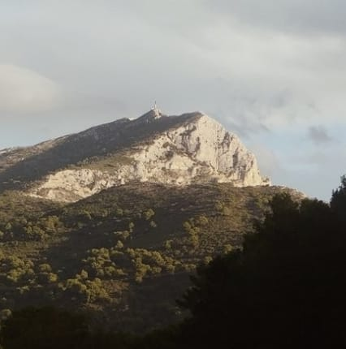

<link rel="stylesheet" href="styles.css">

## Complete List of Talks and Other Communication

### 2025
* ***Phyti Seminar, Inst. Fresnel, Marseille, FR***  
[Slides](https://piyushmishra12.github.io/talks/assets/Transformer%20hand%20simulation.pdf): Understanding Transformers: A step-by-step hand simulation to translate a sentence from English to Hindi, 02.2025

* ***PhD Pub Vidéodrôme 2, Marseille, FR***  
Slides: The secret life of cells (and how to discover it), 02.2025

### 2024
* ***CENTURI Day @ Centre International de Rencontres Mathématiques, Marseille, FR***  
[Poster](https://piyushmishra12.github.io/talks/assets/Eusipco_poster.pdf): Comparative study of transformer robustness for multiple particle tracking without clutter, 12.2024

* ***Séminaire des doctorants de l'Inst. de Mathématiques de Marseille et du Centre de Physique Théorique, Marseille, FR***  
[Slides](https://piyushmishra12.github.io/talks/assets/la-vie-secrete-des-cellules.pdf): La vie secrète des cellules (et comment la découvrir), 11.2024

* ***AI and Physical Sciences (Marseille Federation of Mathematics Research Units), Marseille, FR***  
[Slides](https://piyushmishra12.github.io/talks/assets/ai_in_physical_sciences.pdf): Comparative study of transformer robustness for multiple particle tracking without clutter, 11.2024

* ***European Signal Processing Conference (EUSIPCO), Lyon, FR***  
[Poster](https://piyushmishra12.github.io/talks/assets/Eusipco_poster.pdf): Comparative study of transformer robustness for multiple particle tracking without clutter, 08.2024

* ***3 Minute-Thesis (EUSIPCO), Virtual***  
Video: Weakly-supervised inferences of molecular dynamics for fluorescence imaging in physiological environments, 07.2024

* ***Journées des doctorants 2024 (Inst. Fresnel), Carry-le-Rouet, FR***  
[Poster](https://piyushmishra12.github.io/talks/assets/Piyush_Mishra_Fresnel_Poster.pdf): Weakly-supervised inferences of molecular dynamics for fluorescence imaging in physiological environments, 05.2024
